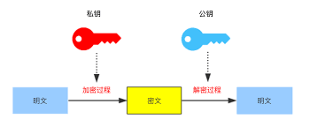

# 对称加密
----
对称加密是最快速、最简单的一种加密方式，加密（encryption）与解密（decryption）用的是同样的密钥（secret key）。
对称加密有很多种算法，由于它效率很高，所以被广泛使用在很多加密协议的核心当中。

对称加密的一大缺点是密钥的管理与分配，换句话说，如何把密钥发送到需要解密你的消息的人的手里是一个问题。在发送密钥的过程中，密钥有很大的风险会被黑客们拦截。现实中通常的做法是将对称加密的密钥进行非对称加密，然后传送给需要它的人。



# DES/3DES
DES算法为密码体制中的对称密码体制，又被称为美国数据加密标准，现已被社区破解，被证明不安全，慢慢被废弃。

算法特点：分组比较短、密钥太短、密码生命周期短、运算速度较慢。

# AES
AES在密码学中又称Rijndael加密法，这个标准用来替代原先的DES，已经被多方分析且广为全世界所使用，已然成为对称密钥加密中最流行的算法之一。

- 足够安全，能很好的抵抗差分分析和线性分析
- 运算速度快，易于实现，而且适合用硬件电路实现
- 对内存要求低
- 密码长度和迭代次数可以扩展

AES难点是参数的多样化。异构系统使用aes进行通信，必须首先确保下面的五个参数是一模一样的。

[快应用cipher模块支持的aes算法](https://doc.quickapp.cn/features/system/cipher.html?h=aes#cipheraesobject-1060)


1. key length（密钥位数，密码长度）`AES128，AES192，AES256（128 位、192 位或 256 位）128位对应的是16个字节，所以部分平台库上，会使用16个字符或者长度为16的字符串来做密码。`

2. key （密钥，密码）`key指的就是密码了，AES128就是128位的，如果位数不够，某些库可能会自动填充到128。`


3. IV（向量）`IV称为初始向量，不同的IV加密后的字符串是不同的，加密和解密需要相同的IV。`


4. mode （加密模式）`AES分为几种模式，比如ECB，CBC，CFB等等，这些模式除了ECB由于没有使用IV而不太安全，其他模式差别并没有太明显。`

5. padding （填充方式）`对于加密解密两端需要使用同一的PADDING模式，大部分PADDING模式为PKCS5, PKCS7, NOPADDING。`

来源：https://blog.csdn.net/u012295261/article/details/100691938

node.js - aes
```js
const crypto = require('crypto');
/**
 * AES加密的配置 
 * 1.密钥 
 * 2.偏移向量 
 * 3.算法模式CBC 
 * 4.补全值
 */
var AES_conf = {
    key: getSecretKey(), //密钥
    iv: '1012132405963708', //偏移向量
    padding: 'PKCS7Padding' //补全值
}
/**
 * 读取密钥key
 * 更具当前客户端的版本vid、平台platform获取对应的key
 */
function getSecretKey() {
    return "abcdabcdabcdabcd";
}
/**
 * AES_128_CBC 加密 
 * 128位 
 * return base64
 */
function encryption(data) {
    let key = AES_conf.key;
    let iv = AES_conf.iv;
    var cipherChunks = [];
    var cipher = crypto.createCipheriv('aes-128-cbc', key, iv);
    cipher.setAutoPadding(true);
    cipherChunks.push(cipher.update(data, 'utf8', 'base64'));
    cipherChunks.push(cipher.final('base64'));
    return cipherChunks.join('');
}
/**
 * 解密
 * return utf8
 */
function decryption(data) {
    let key = AES_conf.key;
    let iv = AES_conf.iv;
    // let padding = AES_conf.padding;

    var cipherChunks = [];
    var decipher = crypto.createDecipheriv('aes-128-cbc', key, iv);
    decipher.setAutoPadding(true);
    cipherChunks.push(decipher.update(data, 'base64', 'utf8'));
    cipherChunks.push(decipher.final('utf8'));
    return cipherChunks.join('');
}

console.log(encryption('hello')); // HACyv/j3Q6wUHFF8uRmWWw==
console.log(decryption('HACyv/j3Q6wUHFF8uRmWWw==')); // hello
```
