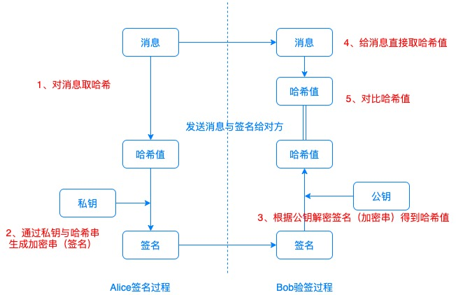
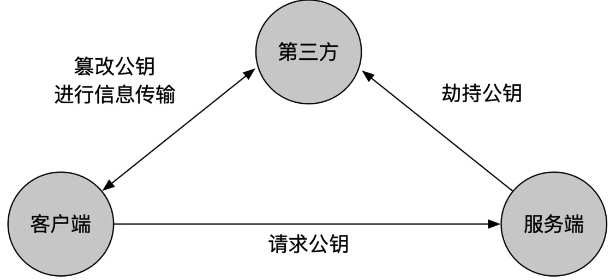
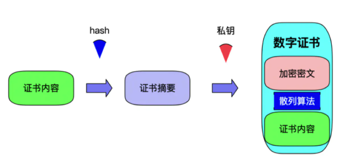
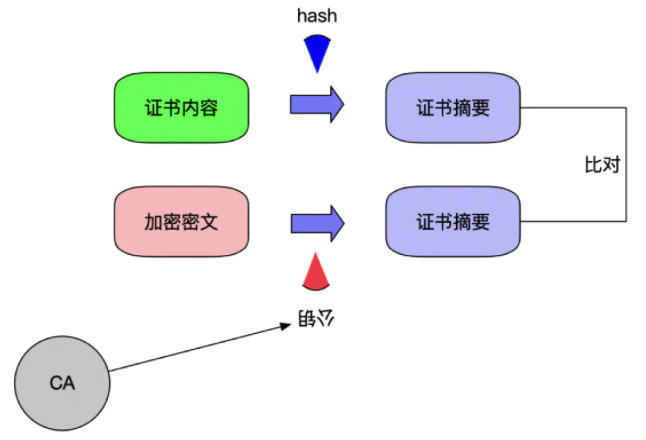

 
# 数字签名与验签

公钥与私钥总是成对儿存在，公钥是公开的，私钥是保密的。

目的：确认消息到底是谁写的？

## 数字签名的流程
虽然可以直接对消息进行加密，但是一般应该是对消息的散列值进行加密。

1. 发送者生成私钥和公钥，将公钥发送给接收者
2. 发送者将消息生成散列值，针对散列值用私钥进行加密，并将加密后的结果发送给接收者
3. 接收者接收到消息后，生成散列值
4. 接收到加密后的散列值后，使用公钥进行解密得到散列值
5. 接收者将自己生成的散列值 和 解密后的散列值进行比对，如果相同则验证成功。

## 中间人攻击

中间人攻击的实质是截获了接收方发出的公钥或者私钥，并将自己的公钥或者私钥发送给另外一方。所以针对公钥密码的中间人攻击，针对数字签名同样有效。
具体解决的办法就是涉及公钥密码的软件都显示公钥的散列值，也就是指纹。比对指纹的正确性就能确认公钥是不是对方的公钥了。

## 利用数字签名攻击公钥密码

A与B进行通信，A是用B的公钥进行加密的，B用私钥进行解密。
数字签名过程中，公钥却是用来解密的，私钥是用来加密的。
而且 公钥密码中的私钥解密 和 数字签名中的私钥加密是相同的公式。
所以，攻击者可以保存A用公钥加密后的消息。然后发邮件给B说需要做一个数字签名实验，需要B对消息进行加密。
B一旦使用自己的私钥对所谓的签名消息进行加密，实际上就是对A发送的消息进行解密。这就完成了攻击。

## 证书

数字证书是由权威的CA（Certificate Authority）机构给服务端进行颁发，CA机构通过服务端提供的相关信息生成证书，证书内容包含了持有人的相关信息，服务器的公钥，签署者签名信息（数字签名）等，最重要的是公钥在数字证书中。

数字证书是如何保证公钥来自请求的服务器呢？数字证书上由持有人的相关信息，通过这点可以确定其不是一个中间人；但是证书也是可以伪造的，如何保证证书为真呢？

一个证书中含有三个部分:"证书内容，散列算法，加密密文"，证书内容会被散列算法hash计算出hash值，然后使用CA机构提供的私钥进行RSA加密。

当客户端发起请求时，服务器将该数字证书发送给客户端，客户端通过CA机构提供的公钥对加密密文进行解密获得散列值（数字签名），同时将证书内容使用相同的散列算法进行Hash得到另一个散列值，比对两个散列值，如果两者相等则说明证书没问题。

## HTTPS--43323

