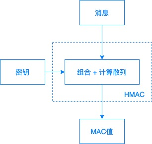

 
# 消息认证码

## MAC
消息认证码是一种确认完整性并进行认证的技术，简称MAC。


输入是一个任意长度的消息和一个两端共享的密钥，输出是一个固定长度的MAC值。


## HMAC
消息认证码的一种最常见实现。H的意思是hash。

HMAC极极极简化版：



密钥绝对不能丢失，一般存储在专用服务器上。
```js
const secret = 'abcdefg';
const shahash = crypto.createHmac('sha256', secret)
    .update('I love cupcakes')
    .digest('hex');
console.log(shahash);
// c0fa1bc00531bd78ef38c628449c5102aeabd49b5dc3a2a516ea6ea959d6658e
```

## 解决的问题

消息认证码可以断定发送者发出的消息与接受者接收到的信息是一致的。

无法向第三方证明，也无法防止否认（即使第三方拥有密钥，也没办法确定发送方）。

