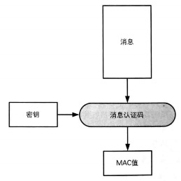
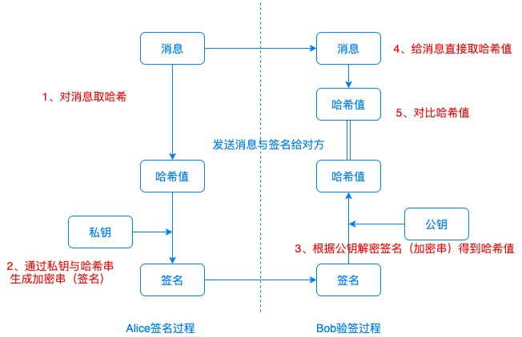
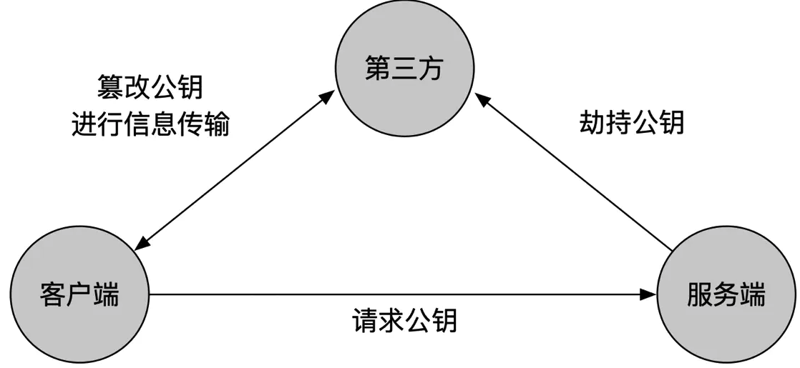
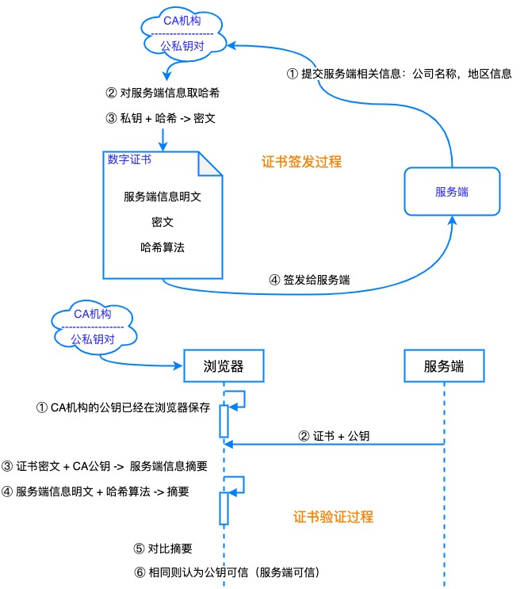
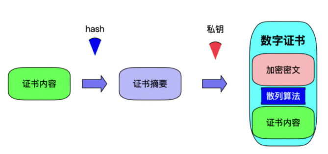
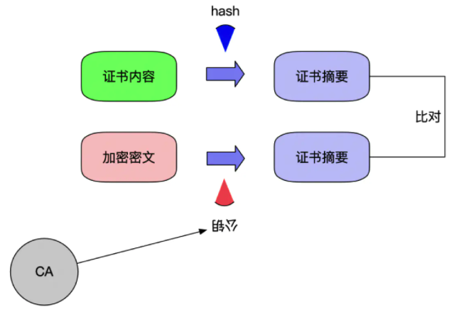
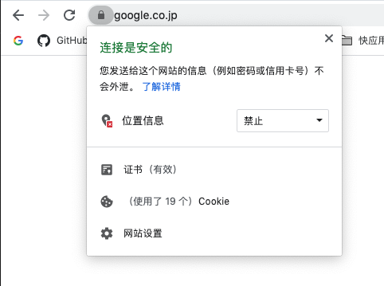
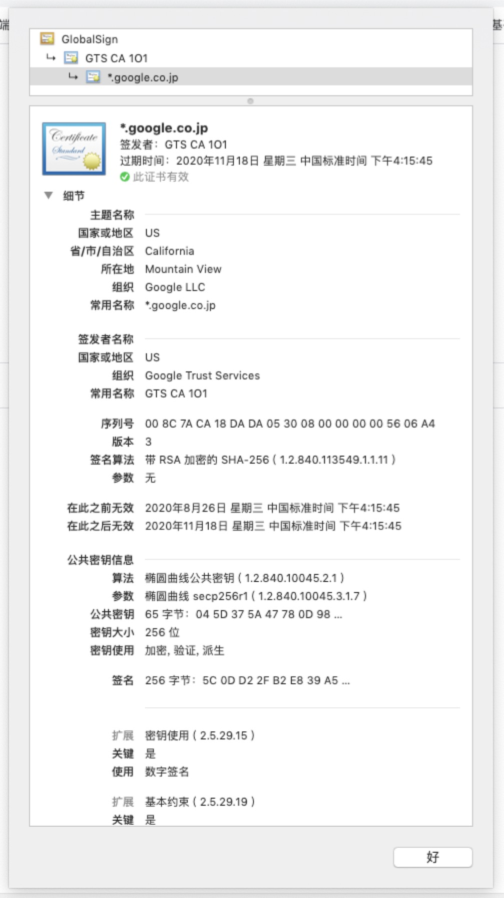
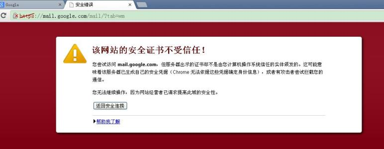

# 
# 哈希函数

____

在记录的关键字与记录的存储地址之间建立的一种对应关系叫哈希函数。
哈希函数就是一种映射，是从关键字到存储地址的映射。
通常，包含哈希函数的算法的算法复杂度都假设为 O(1)，这就是为什么在哈希表中搜索数据的时间复杂度会被认为是"平均为 O(1) 的复杂度"。

node.js支持的哈希算法

```js
const crypto = require('crypto');
console.log(crypto.getHashes());
```
```js
[ 'RSA-MD4',
  'RSA-MD5',
  'RSA-MDC2',
  'RSA-RIPEMD160',
  'RSA-SHA1',
  'RSA-SHA1-2',
  'RSA-SHA224',
  'RSA-SHA256',
  'RSA-SHA3-224',
  'RSA-SHA3-256',
  'RSA-SHA3-384',
  'RSA-SHA3-512',
  'RSA-SHA384',
  'RSA-SHA512',
  'RSA-SHA512/224',
  'RSA-SHA512/256',
  'RSA-SM3',
  'blake2b512',
  'blake2s256',
  'id-rsassa-pkcs1-v1_5-with-sha3-224',
  'id-rsassa-pkcs1-v1_5-with-sha3-256',
  'id-rsassa-pkcs1-v1_5-with-sha3-384',
  'id-rsassa-pkcs1-v1_5-with-sha3-512',
  'md4',
  'md4WithRSAEncryption',
  'md5',
  'md5-sha1',
  'md5WithRSAEncryption',
  'mdc2',
  'mdc2WithRSA',
  'ripemd',
  'ripemd160',
  'ripemd160WithRSA',
  'rmd160',
  'sha1',
  'sha1WithRSAEncryption',
  'sha224',
  'sha224WithRSAEncryption',
  'sha256',
  'sha256WithRSAEncryption',
  'sha3-224',
  'sha3-256',
  'sha3-384',
  'sha3-512',
  'sha384',
  'sha384WithRSAEncryption',
  'sha512',
  'sha512-224',
  'sha512-224WithRSAEncryption',
  'sha512-256',
  'sha512-256WithRSAEncryption',
  'sha512WithRSAEncryption',
  'shake128',
  'shake256',
  'sm3',
  'sm3WithRSAEncryption',
  'ssl3-md5',
  'ssl3-sha1',
```


**MD5**

MD5 即 Message-Digest Algorithm 5（信息-摘要算法 5），用于确保信息传输完整一致。是计算机广泛使用的杂凑算法之一，主流编程语言普遍已有 MD5 实现。
MD5 是输入不定长度信息，输出固定长度 128-bits 的算法。（但是由于128位的标准存储起来也较为麻烦，通常只截取32位）
```js
const crypto = require('crypto')

const md5hash = crypto.createHash('md5')
    .update('Hello, world!')
    .digest('hex');
console.log(md5hash);
// 6cd3556deb0da54bca060b4c39479839
```
基于目前的技术，在数个小时内就可以找到MD5碰撞，使MD5算法不再适合当前的安全环境(密码学意义)。目前，MD5计算广泛应用于错误检查。

例如在一些BitTorrent下载中，软件通过计算MD5和检验下载到的碎片的完整性。

**SHA**

安全散列算法（英语：Secure Hash Algorithm，缩写为SHA）是一个密码散列函数家族，是FIPS所认证的安全散列算法，被认为是替代MD5的下一代杂凑算法。

SHA-1, SHA-224, SHA-256, SHA-384 和 SHA-512等多个变种，本质上是一样的算法，不一样的初始值。
SHA-224、SHA-256、SHA-384，和 SHA-512 并称为 SHA-2。

由于对 MD5 出现成功的破解，以及对 SHA-0 和 SHA-1 出现理论上破解的方法，需要一个与之前算法不同的，可替换的加密杂凑算法，也就是现在的 SHA-3。

安全性：SHA-1 < SHA2 < SHA3，效率反之。


如何破解哈希算法
- 暴力破解
- 字典攻击（庞大的字典数据库）

**加盐**

对于每一个用户的每一个密码，盐值都应该是独一无二且足够长。
数据库应该同时存储哈希和盐值；

存储密码的步骤

1、使用工具生成一个长度足够的盐值
2、将盐值混入密码，并使用标准的加密哈希函数进行加密，如SHA256
3、把哈希值和盐值一块儿存入数据库中对应此用户的那条记录


校验密码的步骤

1、从数据库取出用户的密码哈希值和对应盐值
2、将盐值混入用户输入的密码，而且使用一样的哈希函数进行加密
3、比较上一步的结果和数据库储存的哈希值是否相同，若是相同那么密码正确，反之密码错误
```js
// 加盐
const password = 'Hello, world!';
const salt = Math.random().toString(36).slice(-8);
const md5hash = crypto.createHash('md5')
    .update('Hello, world!' + salt)
    .digest('hex');
console.log(md5hash);
```


 
# 消息认证码

____

**MAC**
消息认证码是一种确认完整性并进行认证的技术，简称MAC。

输入是一个任意长度的消息和一个两端共享的密钥，输出是一个固定长度的MAC值。





**HMAC**
消息认证码的一种最常见实现。H的意思是hash。

HMAC极极极简化版：


密钥绝对不能丢失，一般存储在专用服务器上。
```js
const secret = 'abcdefg';
const shahash = crypto.createHmac('sha256', secret)
    .update('I love cupcakes')
    .digest('hex');
console.log(shahash);
// c0fa1bc00531bd78ef38c628449c5102aeabd49b5dc3a2a516ea6ea959d6658e
```

**解决的问题**

消息认证码可以断定发送者发出的消息与接受者接收到的信息是一致的。

无法向第三方证明，也无法防止否认（即使第三方拥有密钥，也没办法确定发送方）。

# 数字签名与验签
____

公钥与私钥总是成对儿存在，公钥是公开的，私钥是保密的。

目的：确认消息到底是谁写的？

**数字签名的流程**

虽然可以直接对消息进行加密，但是一般应该是对消息的散列值进行加密。

1. 发送者生成私钥和公钥，将公钥发送给接收者
2. 发送者将消息生成散列值，针对散列值用私钥进行加密，并将加密后的结果发送给接收者
3. 接收者接收到消息后，生成散列值
4. 接收到加密后的散列值后，使用公钥进行解密得到散列值
5. 接收者将自己生成的散列值 和 解密后的散列值进行比对，如果相同则验证成功。



**中间人攻击**

中间人攻击的实质是截获了接收方发出的公钥或者私钥，并将自己的公钥或者私钥发送给另外一方。所以针对公钥密码的中间人攻击，针对数字签名同样有效。
具体解决的办法就是涉及公钥密码的软件都显示公钥的散列值，也就是指纹。比对指纹的正确性就能确认公钥是不是对方的公钥了(多一层保险而已，指纹也有可能被劫持)。



**利用数字签名攻击公钥密码**

A与B进行通信，A是用B的公钥进行加密的，B用私钥进行解密。

数字签名过程中，公钥却是用来解密的，私钥是用来加密的。

而且 公钥密码中的私钥解密 和 数字签名中的私钥加密是相同的公式。

所以，攻击者可以保存A用公钥加密后的消息。然后发邮件给B说需要做一个数字签名实验，需要B对消息进行加密。

B一旦使用自己的私钥对所谓的签名消息进行加密，实际上就是对A发送的消息进行解密。这就完成了攻击。


# 证书

___

数字证书是由权威的CA（Certificate Authority）机构给服务端进行颁发，CA机构通过服务端提供的相关信息生成证书，证书内容包含了持有人的相关信息，服务器的公钥，签署者签名信息（数字签名）等，最重要的是公钥在数字证书中。




<!--  -->

当客户端发起请求时，服务器将该数字证书发送给客户端，客户端通过CA机构提供的公钥对加密密文进行解密获得散列值（数字签名），同时将证书内容使用相同的散列算法进行Hash得到另一个散列值，比对两个散列值，如果两者相等则说明证书没问题。

<!--  -->


**浏览器与证书**

安全证书



证书细节



不受信证书




# HTTPS

----

 **HTTP是不安全的**
 HTTP 传输面临的风险有

（1） 窃听风险：黑客可以获知通信内容。

（2） 篡改风险：黑客可以修改通信内容。

（3） 冒充风险：黑客可以冒充他人身份参与通信。

**HTTPS通信原理**


