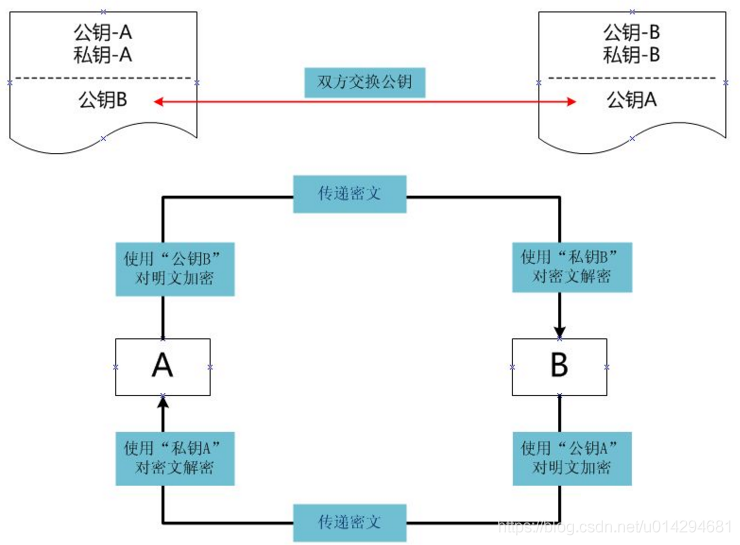

非对称加密需要两个密钥：公钥 (publickey) 和私钥 (privatekey)。公钥和私钥是一对，如果用公钥对数据加密，那么只能用对应的私钥解密。如果用私钥对数据加密，只能用对应的公钥进行解密。因为加密和解密用的是不同的密钥，所以称为非对称加密。

非对称加密算法的保密性好，它消除了最终用户交换密钥的需要，但是加解密速度要远远慢于对称加密。




# RSA算法

RSA 是目前最有影响力的公钥加密算法，该算法基于一个十分简单的数论事实：`将两个大素数相乘十分容易，但想要对其乘积进行因式分解却极其困难`，因此可以将乘积公开作为加密密钥，即公钥，而两个大素数组合成私钥。公钥是可发布的供任何人使用，私钥则为自己所有，供解密之用。

[快应用支持RSA加解密](https://doc.quickapp.cn/features/system/cipher.html?h=aes#cipherrsaobject)

util.js
```js
const fs = require('fs');
const path = require('path');
const crypto = require('crypto');

function generateKeys() {
    const { publicKey, privateKey } = crypto.generateKeyPairSync('rsa', {
        modulusLength: 4096,
        publicKeyEncoding: {
            type: 'pkcs1',
            format: 'pem',
        },
        privateKeyEncoding: {
            type: 'pkcs1',
            format: 'pem',
            cipher: 'aes-256-cbc',
            passphrase: '',
        },
    });
    fs.writeFileSync('private.cer', privateKey);
    fs.writeFileSync('public.cer', publicKey);
}

function encrypt(plain, pathToPublicKey) {
    const publicKey = fs.readFileSync(path.resolve(__dirname, pathToPublicKey), 'utf8');
    const buffer = Buffer.from(plain, 'utf8');
    return crypto.publicEncrypt(publicKey, buffer).toString('base64');
}

function decrypt(cipher, pathToPrivateKey) {
    const privateKey = fs.readFileSync(path.resolve(__dirname, pathToPrivateKey), 'utf8');
    const buffer = Buffer.from(cipher, 'base64');
    const plain = crypto.privateDecrypt({
        key: privateKey.toString(),
        passphrase: ''
    }, buffer);
    return plain.toString('utf8')
}

```

index.js
```js
const { generateKeys, encrypt, decrypt } = require('./utils');

generateKeys();
const cypher = encrypt('hello', 'public.cer');
console.log(cypher);
const plain = decrypt(cypher, 'private.cer');
console.log(plain);

/**
 wW+/d+lpaT2H0jW2v9EQZC1gINrhbMKyPR5+zwm08VLukFOpL3OPQXVdLGT1fEA3A/oYKrAZQYeZJ0gv9H87ZBf/aAVwP3R3qA5I+mQ3EkDxBHqyOg8uUK9zzttv2/cuf5Evm7dSYIIykchmNhIih9BBC5aCBCRrRSte0FTq2zvpaEITGSlEsJsBjfqwZ8yhCfR/jTEizgvE39TF2PfBLkzxa5roenjaBj6znm01lxMAdGoI5uPEPLKh06VpjAYfCkWhBRAYzxEsDbusbmsaXKGqFnQbsO8MVZkN8k1tkn4Kfum0DyhgzEtHD1vgujXZ3E4EVn/M0ehCb70G/t099w2rLWwmKHJUztGPvNrGCDCnuwAh9L/uMmN2sQAp0KHAEKGW3ikxq0U+G7Fsm7tProaa7uPyjgbAppeQu73lDGy/8QTBqAPmmpwWKMqzpnIoAwF+QxI4L7o8U9lqc2VvK5fra2nR7T4+O9SkgY8pMQqyE7lbXLujY/cZPjnb9G9n39TYMCFr8pVtqBIF/Go68QDjjkcWFGyI8uwmzA7tax6E92QWc6ETc3ACW4uxN1B+yBFsEITaYYxe57rWUMVNQC0FUSeliwaGMIeTI7S/Kl9DunY8d9XKQ7KwjEdlxkY8hFBjMBAdG/8N/ndLtjRn+wNjIgU19o/5dBWbaTaRJbM=
 hello
 * 
 * 

```
# DSA算法
# ECC算法
# DH算法