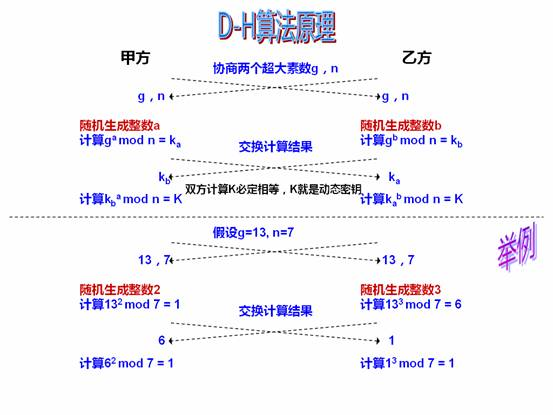

# 
# 非对称加密

---

非对称加密需要两个密钥：公钥 (publickey) 和私钥 (privatekey)。公钥和私钥是一对，如果用公钥对数据加密，那么只能用对应的私钥解密。如果用私钥对数据加密，只能用对应的公钥进行解密。因为加密和解密用的是不同的密钥，所以称为非对称加密。

非对称加密算法的保密性好，它消除了最终用户交换密钥的需要，但是加解密速度要远远慢于对称加密。


# RSA算法

RSA 是目前最有影响力的公钥加密算法，该算法基于一个十分简单的数论事实：`将两个大素数相乘十分容易，但想要对其乘积进行因式分解却极其困难`，因此可以将乘积公开作为加密密钥，即公钥，而两个大素数组合成私钥。公钥是可发布的供任何人使用，私钥则为自己所有，供解密之用。

[快应用支持RSA加解密](https://doc.quickapp.cn/features/system/cipher.html?h=aes#cipherrsaobject)

util.js
```js
const fs = require('fs');
const path = require('path');
const crypto = require('crypto');

function generateKeys() {
    const { publicKey, privateKey } = crypto.generateKeyPairSync('rsa', {
        modulusLength: 4096,
        publicKeyEncoding: {
            type: 'pkcs1',
            format: 'pem',
        },
        privateKeyEncoding: {
            type: 'pkcs1',
            format: 'pem',
            cipher: 'aes-256-cbc',
            passphrase: '',
        },
    });
    fs.writeFileSync('private.cer', privateKey);
    fs.writeFileSync('public.cer', publicKey);
}

function encrypt(plain, pathToPublicKey) {
    const publicKey = fs.readFileSync(path.resolve(__dirname, pathToPublicKey), 'utf8');
    const buffer = Buffer.from(plain, 'utf8');
    return crypto.publicEncrypt(publicKey, buffer).toString('base64');
}

function decrypt(cipher, pathToPrivateKey) {
    const privateKey = fs.readFileSync(path.resolve(__dirname, pathToPrivateKey), 'utf8');
    const buffer = Buffer.from(cipher, 'base64');
    const plain = crypto.privateDecrypt({
        key: privateKey.toString(),
        passphrase: ''
    }, buffer);
    return plain.toString('utf8')
}

```

index.js
```js
const { generateKeys, encrypt, decrypt } = require('./utils');

generateKeys();
const cypher = encrypt('hello', 'public.cer');
console.log(cypher);
const plain = decrypt(cypher, 'private.cer');
console.log(plain);

/**
 wW+/d+lpaT2H0jW2v9EQZC1gINrhbMKyPR5+zwm08VLukFOpL3OPQXVdLGT1fEA3A/oYKrAZQYeZJ0gv9H87ZBf/aAVwP3R3qA5I+mQ3EkDxBHqyOg8uUK9zzttv2/cuf5Evm7dSYIIykchmNhIih9BBC5aCBCRrRSte0FTq2zvpaEITGSlEsJsBjfqwZ8yhCfR/jTEizgvE39TF2PfBLkzxa5roenjaBj6znm01lxMAdGoI5uPEPLKh06VpjAYfCkWhBRAYzxEsDbusbmsaXKGqFnQbsO8MVZkN8k1tkn4Kfum0DyhgzEtHD1vgujXZ3E4EVn/M0ehCb70G/t099w2rLWwmKHJUztGPvNrGCDCnuwAh9L/uMmN2sQAp0KHAEKGW3ikxq0U+G7Fsm7tProaa7uPyjgbAppeQu73lDGy/8QTBqAPmmpwWKMqzpnIoAwF+QxI4L7o8U9lqc2VvK5fra2nR7T4+O9SkgY8pMQqyE7lbXLujY/cZPjnb9G9n39TYMCFr8pVtqBIF/Go68QDjjkcWFGyI8uwmzA7tax6E92QWc6ETc3ACW4uxN1B+yBFsEITaYYxe57rWUMVNQC0FUSeliwaGMIeTI7S/Kl9DunY8d9XKQ7KwjEdlxkY8hFBjMBAdG/8N/ndLtjRn+wNjIgU19o/5dBWbaTaRJbM=
 hello
 * 
 * 

```
# DSA算法

DSA（Digital Signature Algorithm，数字签名算法，用作数字签名标准的一部分），它是另一种公开密钥算法，它不能用作加密，只用作数字签名。简单的说，这是一种更高级的验证方式，用作数字签名。不单单只有公钥、私钥，还有数字签名。私钥加密生成数字签名，公钥验证数据及签名，如果数据和签名不匹配则认为验证失败。数字签名的作用就是校验数据在传输过程中不被修改，数字签名，是单向加密的升级。


# ECC算法

椭圆加密算法（ECC）是一种公钥加密算法，最初由 Koblitz 和 Miller 两人于1985年提出，其数学基础是利用椭圆曲线上的有理点构成 Abel 加法群上椭圆离散对数的计算困难性。

公钥密码体制根据其所依据的难题一般分为三类：`大整数分解问题类`、`离散对数问题类`、`椭圆曲线类`。有时也把椭圆曲线类归为离散对数类。

ECC 被广泛认为是在给定密钥长度的情况下，最强大的非对称算法，因此在对带宽要求十分紧的连接中会十分有用。

不过一个缺点是加密和解密操作的实现比其他机制花费的时间长。

> 比特币钱包公钥的生成使用了椭圆曲线算法，通过椭圆曲线乘法可以从私钥计算得到公钥， 这是不可逆转的过程。

# DH算法

全称为"Diffie-Hellman"，Diffie-Hellman密钥协商（交换）算法主要解决在公网（不安全网络）秘钥配送问题。



```
（1）Alice与Bob确定两个大素数n和g，这两个数不用保密

（2）Alice选择另一个大随机数x，并计算A如下：A=gxmod n

（3）Alice将A发给Bob

（4）Bob  选择另一个大随机数y，并计算B如下：B=gymod n

（5）Bob将B发给Alice

（6）计算秘密密钥K1如下：K1=Bxmod n

（7）计算秘密密钥K2如下：K2=Aymod n

 K1=K2，因此Alice和Bob可以用其进行加解密
```

**攻击者知道p和g，并且截获了Ka和Kb，但是当它们都是非常大的数的时候，依靠这四个数来计算a和b非常困难，这就是离散对数数学难题。**

然而，该技术也存在许多不足： 没有提供双方身份的任何信息. 它是计算密集性的，因此容易遭受阻塞性攻击。